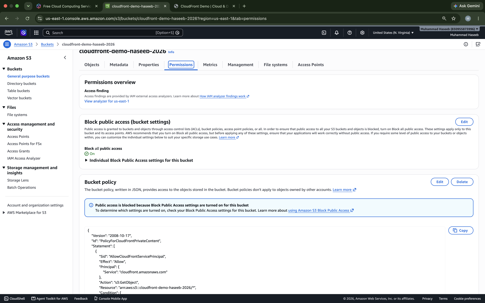
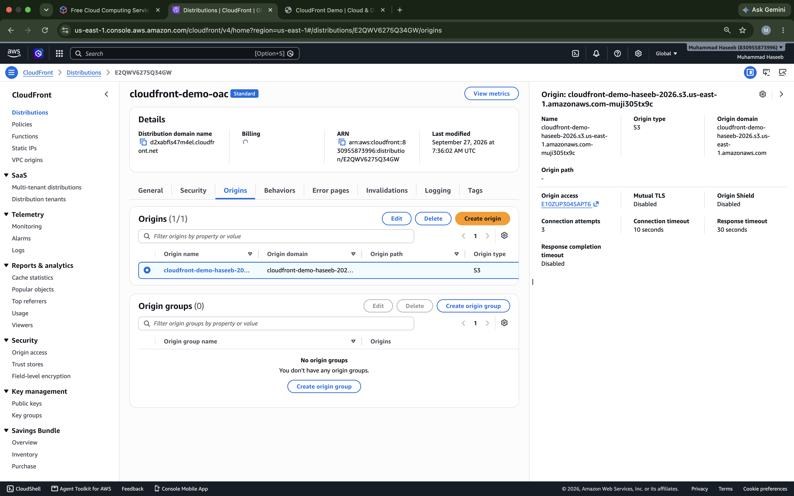

# 🚀 Amazon CloudFront — S3 CDN Deployment

This project demonstrates how to use **Amazon CloudFront** as a Content Delivery Network (CDN) to deliver a static website stored in a private Amazon S3 bucket.

The project uses **Origin Access Control (OAC)** so that CloudFront can access the private S3 bucket without making the bucket publicly accessible.

---

## 📌 Project Overview

In this hands-on project, I deployed a simple HTML website using:

* **Amazon S3** — Stores the website files
* **Amazon CloudFront** — Delivers the website through a global CDN
* **Origin Access Control (OAC)** — Provides secure access from CloudFront to the private S3 bucket
* **HTTPS** — Used to securely access the website

---

## 🏗️ Architecture

```text
                    🌍 Internet
                        │
                        ▼
               ┌─────────────────┐
               │  Amazon         │
               │  CloudFront     │
               │     CDN         │
               └────────┬────────┘
                        │
                        │ OAC
                        ▼
               ┌─────────────────┐
               │   Amazon S3     │
               │     Private     │
               │     Bucket      │
               └────────┬────────┘
                        │
                        ▼
                   index.html
```

### Request Flow

```text
User
  │
  ▼
CloudFront Edge Location
  │
  ├── Cache Hit → Return cached content
  │
  └── Cache Miss
          │
          ▼
        S3 Origin
          │
          ▼
       index.html
```

---

# 🎯 Objectives

The objectives of this project were to:

* Understand Amazon CloudFront
* Create a CloudFront distribution
* Use Amazon S3 as a CloudFront origin
* Keep the S3 bucket private
* Configure Origin Access Control (OAC)
* Serve a static website through CloudFront
* Understand the relationship between S3 and CloudFront
* Access the website using a CloudFront HTTPS URL

---

# 🛠️ AWS Services Used

| Service               | Purpose                        |
| --------------------- | ------------------------------ |
| Amazon S3             | Store website files            |
| Amazon CloudFront     | Content delivery and caching   |
| Origin Access Control | Secure CloudFront-to-S3 access |
| HTTPS                 | Secure communication           |

---

# 🚀 Implementation

## Step 1 — Create S3 Bucket

Created an S3 bucket to store the website.

The bucket was kept **private** and public access was blocked.

Website file:

```text
index.html
```

### Screenshot


---

## Step 2 — Block Public Access

S3 **Block all public access** was enabled.

This means users cannot directly access the S3 bucket publicly.

Instead, CloudFront is responsible for delivering the website.

### Screenshot



---

## Step 3 — Upload Website

Created a simple HTML page:

```html
<!DOCTYPE html>
<html>
<head>
    <title>CloudFront Demo</title>
</head>
<body>
    <h1>Hello from Amazon CloudFront 🚀</h1>
    <p>This website is being delivered through CloudFront.</p>
    <p>Cloud & DevOps Learning Project</p>
</body>
</html>
```

Uploaded the file to the S3 bucket as:

```text
index.html
```

---

## Step 4 — Create CloudFront Distribution

Created a CloudFront distribution with the S3 bucket configured as the origin.

The distribution provides a CloudFront domain similar to:

```text
https://d2xabfls47m4el.cloudfront.net
```

### Screenshot


---

## Step 5 — Configure Origin Access Control

Configured **Origin Access Control (OAC)** for the S3 origin.

OAC allows CloudFront to securely access objects in the private S3 bucket.

```text
CloudFront
     │
     │ OAC
     ▼
Private S3 Bucket
```

### Screenshot



---

## Step 6 — Configure Default Root Object

Configured:

```text
Default Root Object:
index.html
```

This allows users to visit the CloudFront domain without manually specifying `/index.html`.

For example:

```text
https://d2xabfls47m4el.cloudfront.net/
```

CloudFront serves:

```text
index.html
```

### Screenshot


---

# 🌐 Live Website

The website is accessible through the CloudFront distribution:

```text
https://d2xabfls47m4el.cloudfront.net
```

### Screenshot


---

# 📊 CloudFront Caching Concept

CloudFront caches content at its edge locations.

### Cache Hit

If the requested content is already cached:

```text
User
  ↓
CloudFront
  ↓
Cached Content
  ↓
User
```

The request can be served without contacting S3.

### Cache Miss

If the content isn't cached:

```text
User
  ↓
CloudFront
  ↓
S3 Origin
  ↓
CloudFront Cache
  ↓
User
```

CloudFront retrieves the content from S3 and can cache it for subsequent requests.

---

# 🔐 Security

This project follows a more secure architecture by keeping the S3 bucket private.

### Security configuration

```text
S3 Public Access
       ↓
     BLOCKED

CloudFront
       ↓
      OAC
       ↓
Private S3 Bucket
```

Users access the website through CloudFront rather than directly accessing the S3 bucket.

---

# 📚 What I Learned

Through this project, I learned:

* What a CDN is
* How Amazon CloudFront works
* What an origin is
* What CloudFront edge locations do
* Difference between cache hit and cache miss
* How to use S3 as a CloudFront origin
* How Origin Access Control works
* Why keeping an S3 origin private is useful
* How HTTPS is provided through CloudFront
* How CloudFront delivers static content

---

# 🧹 AWS Resource Cleanup

After completing the lab, AWS resources should be reviewed to avoid unnecessary charges.

Before deleting the CloudFront distribution:

1. Disable the CloudFront distribution.
2. Wait until the distribution is disabled.
3. Delete the distribution.
4. Delete the S3 bucket if it is no longer needed.
5. Delete the objects from the bucket before deleting the bucket.

> Always check the AWS Console to confirm that resources are no longer running or generating charges.

---

# 📸 Project Screenshots

```text
screenshots/
├── 01-s3-bucket.png
├── 02-s3-block-public-access.png
├── 03-cloudfront-distribution.png
├── 04-cloudfront-origin-oac.png
├── 05-default-root-object.png
├── 06-cloudfront-live-website.png
└── 07-cloudfront-architecture.png
```

---

# 🚀 Project Status

**Completed ✅**

This project successfully demonstrates a static website hosted in a private S3 bucket and delivered through Amazon CloudFront using Origin Access Control.
