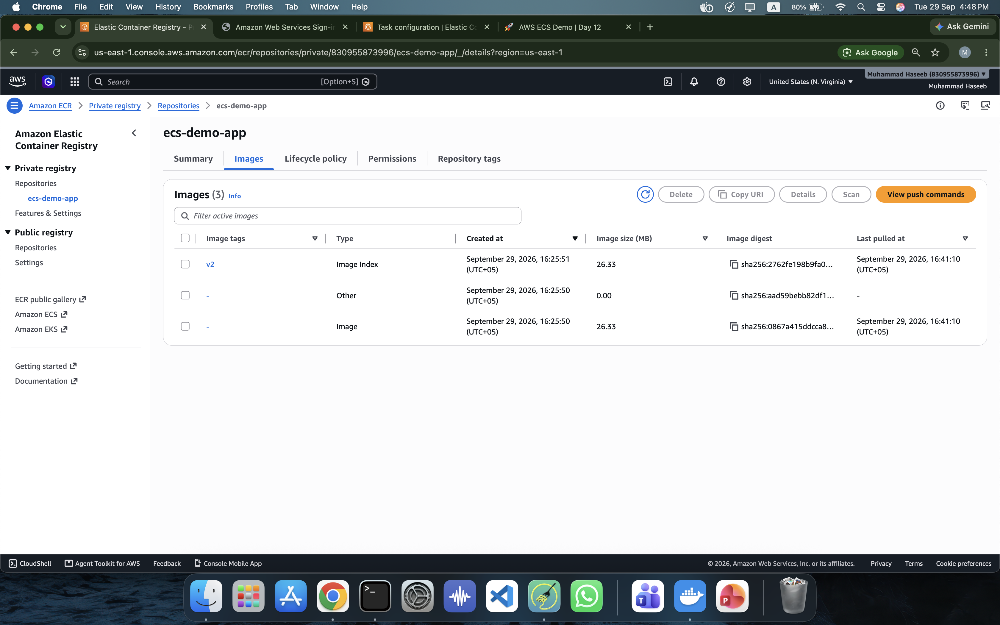
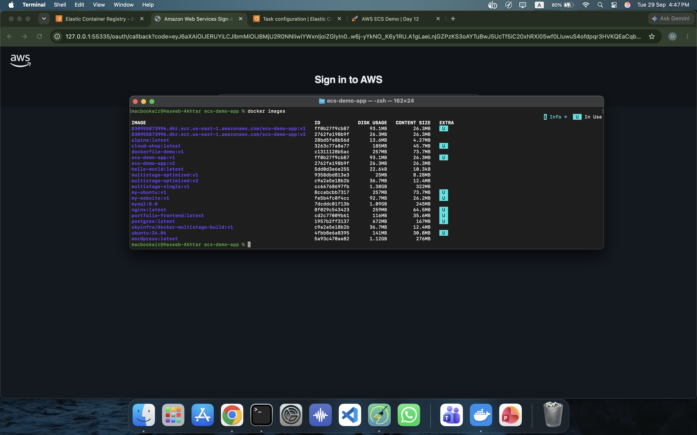
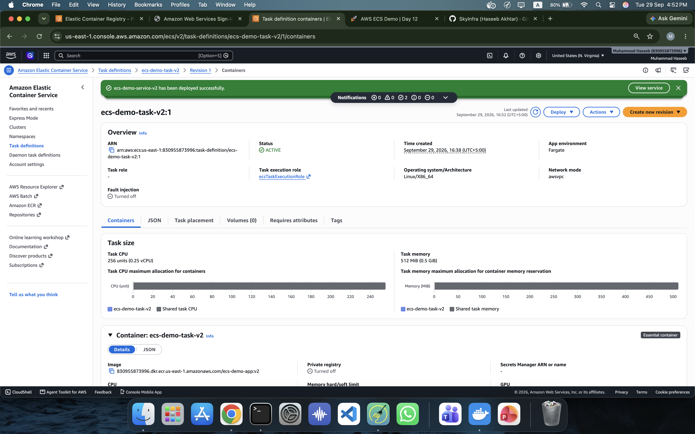
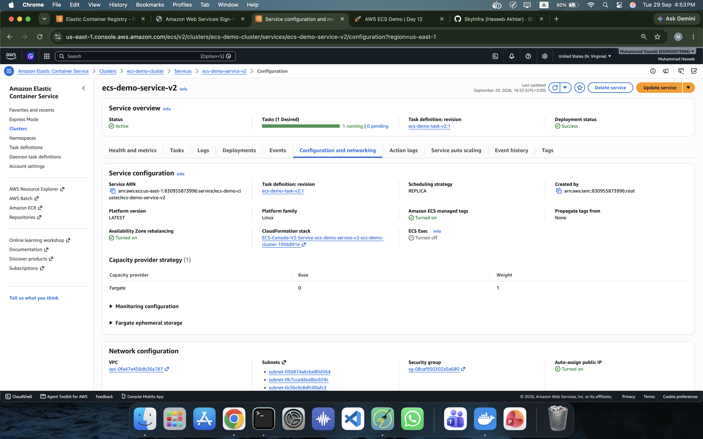

# 🚀 Amazon ECS — Deploying a Dockerized Application with AWS Fargate

This project demonstrates how to take a simple web application, package it into a Docker container, push the image to **Amazon ECR**, and deploy it on **Amazon ECS using AWS Fargate**.

The goal of this hands-on project was to understand the complete container deployment workflow from a local machine to AWS.

---

## 📌 What is Amazon ECS?

**Amazon Elastic Container Service (ECS)** is a fully managed AWS service used to run and manage Docker containers.

Instead of manually managing servers, ECS allows us to deploy, run, scale, and manage containerized applications.

For this project, I used **AWS Fargate**, which allows ECS to run containers without managing EC2 servers.

---

## 🏗️ Project Architecture

```text
Local Application
       │
       ▼
   Docker Image
       │
       ▼
 Amazon ECR
       │
       ▼
 Amazon ECS
       │
       ▼
    Fargate
       │
       ▼
 Running Container
       │
       ▼
 Web Application
```

---

## 🧰 Technologies Used

* HTML
* CSS
* JavaScript
* Docker
* Amazon ECR
* Amazon ECS
* AWS Fargate
* AWS VPC
* AWS Security Groups
* AWS CLI

---

# 📁 Project Structure

```text
day-13-amazon-ecs/
│
├── README.md
│
├── app/
│   ├── index.html
│   ├── style.css
│   ├── script.js
│   └── Dockerfile
│
└── screenshots/
    ├── 01-local-docker-app.png
    ├── 02-docker-image.png
    ├── 03-ecr-repository.png
    ├── 04-ecs-task-definition.png
    ├── 05-ecs-service-running.png
    ├── 06-fargate-task-networking.png
    └── 07-ecs-app-live.png
```

---

# 🌐 Application

The application is a simple static website created using HTML, CSS, and JavaScript.

It displays:

* AWS ECS information
* Docker → ECR → ECS architecture
* Application status
* Cloud & DevOps learning information

The application is served using **Nginx** inside the Docker container.

---

# 🐳 Docker Configuration

The application uses the following Dockerfile:

```dockerfile
FROM nginx:alpine

COPY index.html /usr/share/nginx/html/index.html
COPY style.css /usr/share/nginx/html/style.css
COPY script.js /usr/share/nginx/html/script.js

EXPOSE 80
```

### Explanation

* `FROM nginx:alpine` → Uses a lightweight Nginx image.
* `COPY` → Copies the application files into Nginx's web directory.
* `EXPOSE 80` → Documents that the application listens on port 80.

---

# 1️⃣ Build the Docker Image

From the `app` directory:

```bash
docker build -t ecs-demo-app:v1 .
```

This creates a Docker image named:

```text
ecs-demo-app:v1
```

---

# 2️⃣ Run the Application Locally

```bash
docker run -d --name ecs-demo-container -p 8080:80 ecs-demo-app:v1
```

The application can then be accessed at:

```text
http://localhost:8080
```

### Verify the container

```bash
docker ps
```

The container should show a running status.

### 📸 Evidence


---

# 3️⃣ Create an Amazon ECR Repository

An **Amazon Elastic Container Registry (ECR)** repository stores Docker images in AWS.

Repository used for this project:

```text
ecs-demo-app
```

AWS Region:

```text
us-east-1
```

The ECR repository URI was:

```text
830955873996.dkr.ecr.us-east-1.amazonaws.com/ecs-demo-app
```

### 📸 Evidence



---

# 4️⃣ Authenticate Docker with Amazon ECR

```bash
aws ecr get-login-password --region us-east-1 | \
docker login --username AWS --password-stdin \
830955873996.dkr.ecr.us-east-1.amazonaws.com
```

Expected output:

```text
Login Succeeded
```

This allows Docker to push images to the ECR repository.

---

# 5️⃣ Build the Image for AWS Fargate

Because the development machine uses Apple Silicon, the initial Docker image was built for **ARM64**.

The ECS Fargate task was configured for **X86_64**, so the first image could not be pulled by the task.

The image was rebuilt for the required architecture:

```bash
docker build --platform linux/amd64 -t ecs-demo-app:v2 .
```

This created an AMD64-compatible image.

---

# 6️⃣ Tag the Docker Image

```bash
docker tag ecs-demo-app:v2 \
830955873996.dkr.ecr.us-east-1.amazonaws.com/ecs-demo-app:v2
```

The image was now associated with the ECR repository.

---

# 7️⃣ Push the Image to Amazon ECR

```bash
docker push \
830955873996.dkr.ecr.us-east-1.amazonaws.com/ecs-demo-app:v2
```

After the push completed, the Docker image was available in Amazon ECR.

### 📸 Evidence



---

# 8️⃣ Create an ECS Cluster

An ECS cluster was created with the following configuration:

```text
Cluster Name: ecs-demo-cluster
Capacity Provider: Fargate
```

The cluster provides the logical environment where ECS tasks and services run.

---

# 9️⃣ Create the ECS Task Definition

A task definition describes how ECS should run the container.

Configuration used:

| Setting        | Value             |
| -------------- | ----------------- |
| Launch Type    | Fargate           |
| OS             | Linux             |
| Architecture   | X86_64            |
| CPU            | 0.25 vCPU         |
| Memory         | 512 MiB           |
| Network Mode   | awsvpc            |
| Container Port | 80                |
| Protocol       | TCP               |
| Image          | `ecs-demo-app:v2` |

The task execution role used was:

```text
ecsTaskExecutionRole
```

### 📸 Evidence



---

# 🔟 Create an ECS Service

The ECS service was configured to keep the desired number of tasks running.

Configuration:

```text
Service Name: ecs-demo-service-v2
Desired Tasks: 1
Launch Type: Fargate
```

The service successfully launched one running task.

### 📸 Evidence


---

# 🌐 Networking

The Fargate task used the AWS VPC networking model with:

* VPC
* Subnet
* Security Group
* Elastic Network Interface (ENI)
* Public IP address

The task was configured with:

```text
Auto-assign Public IP: Enabled
```

The security group allowed HTTP traffic to port:

```text
80
```

### 📸 Evidence



---

# 🌍 Application Running on AWS

After the ECS service started successfully, the Fargate task received network connectivity and the Nginx container started serving the application.

The application was accessible through the task's public IP address.

### 📸 Evidence


---

# ⚠️ Important Issue: ARM64 vs AMD64

One of the important problems encountered during this project was a Docker architecture mismatch.

The development machine uses Apple Silicon, which commonly builds images for:

```text
linux/arm64
```

The ECS task was configured for:

```text
X86_64
```

This caused the container to fail when ECS attempted to pull the image.

The solution was to explicitly build the Docker image for AMD64:

```bash
docker build --platform linux/amd64 -t ecs-demo-app:v2 .
```

This was an important practical lesson about **container image architecture compatibility**.

---

# 🔄 Complete Deployment Workflow

```text
HTML / CSS / JavaScript
          │
          ▼
       Docker
          │
          ▼
    Docker Image
          │
          ▼
      Amazon ECR
          │
          ▼
    ECS Task Definition
          │
          ▼
     ECS Service
          │
          ▼
       Fargate
          │
          ▼
   Running Container
          │
          ▼
    Web Application
```

---

# 🧹 Cleanup

After completing the hands-on lab and capturing the required screenshots, the ECS resources were removed to avoid unnecessary AWS charges.

Resources to review/delete after a lab include:

* ECS service
* ECS cluster
* Task definition revisions
* ECR repository/images
* Security groups
* Other networking resources created specifically for the lab

Always verify that unused AWS resources are removed.

---

# 🎯 Key Learnings

Through this project, I learned how to:

* Understand Amazon ECS
* Understand ECS clusters, tasks, and services
* Understand AWS Fargate
* Dockerize a web application
* Build Docker images
* Push Docker images to Amazon ECR
* Create ECS task definitions
* Deploy containers using Fargate
* Configure container port mappings
* Configure security groups
* Understand Fargate networking
* Troubleshoot Docker architecture compatibility
* Deploy a containerized application on AWS

---

# 🚀 Next Steps

Possible improvements to this project include:

* Deploying ECS behind an Application Load Balancer
* Using a custom domain
* Adding HTTPS with AWS Certificate Manager
* Creating an ECS private-subnet architecture
* Adding CloudWatch logging and monitoring
* Configuring ECS auto scaling
* Automating deployment using GitHub Actions
* Building a complete CI/CD pipeline

---

## 📚 Project Purpose

This project is part of my **Cloud & DevOps learning journey** and focuses on understanding how containerized applications move from local development to production-oriented AWS infrastructure.
