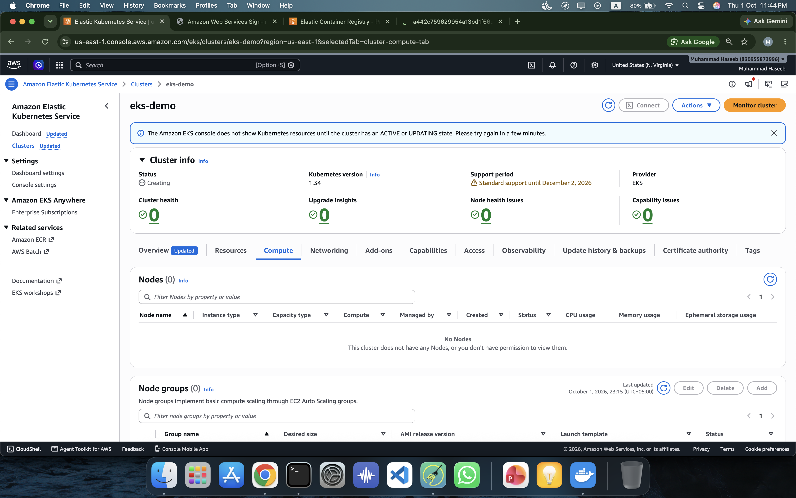
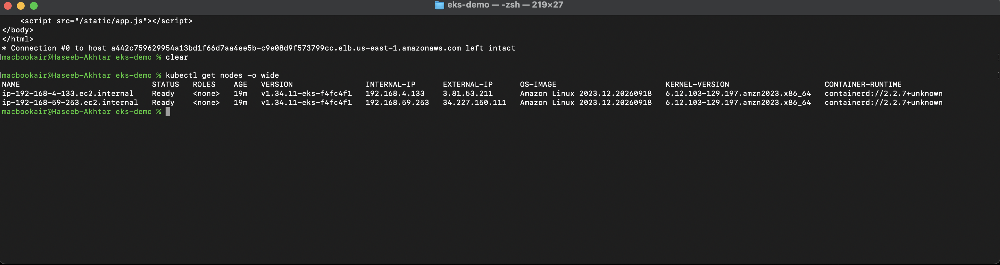
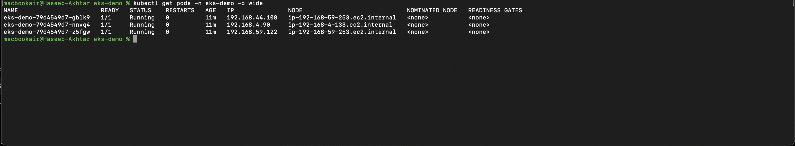
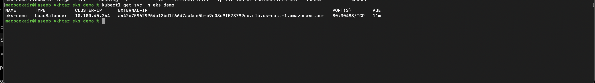
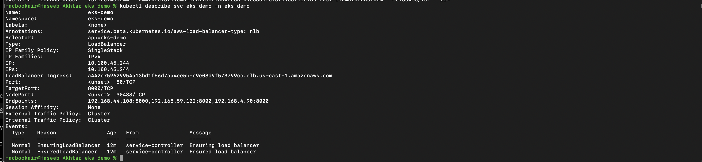
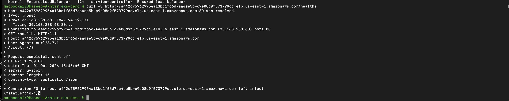
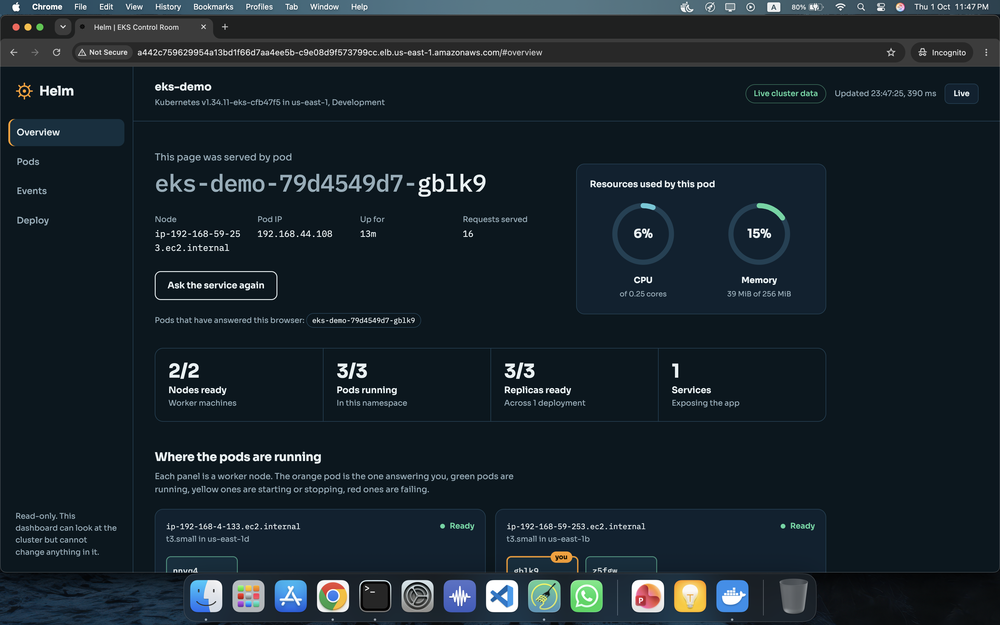
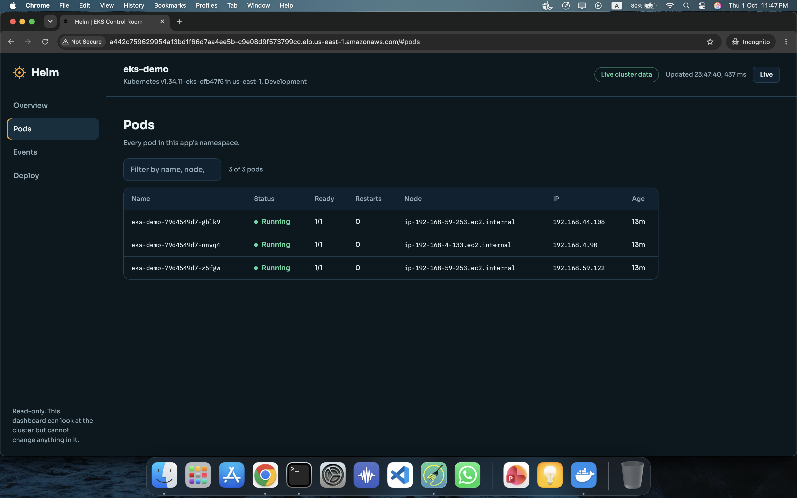
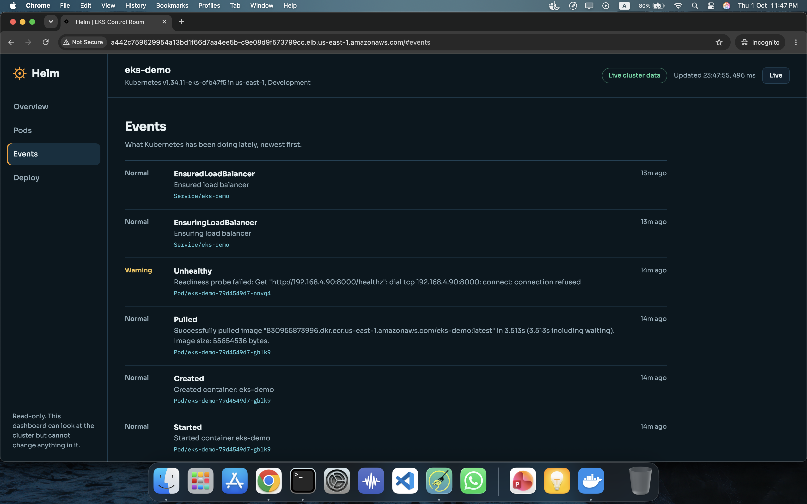
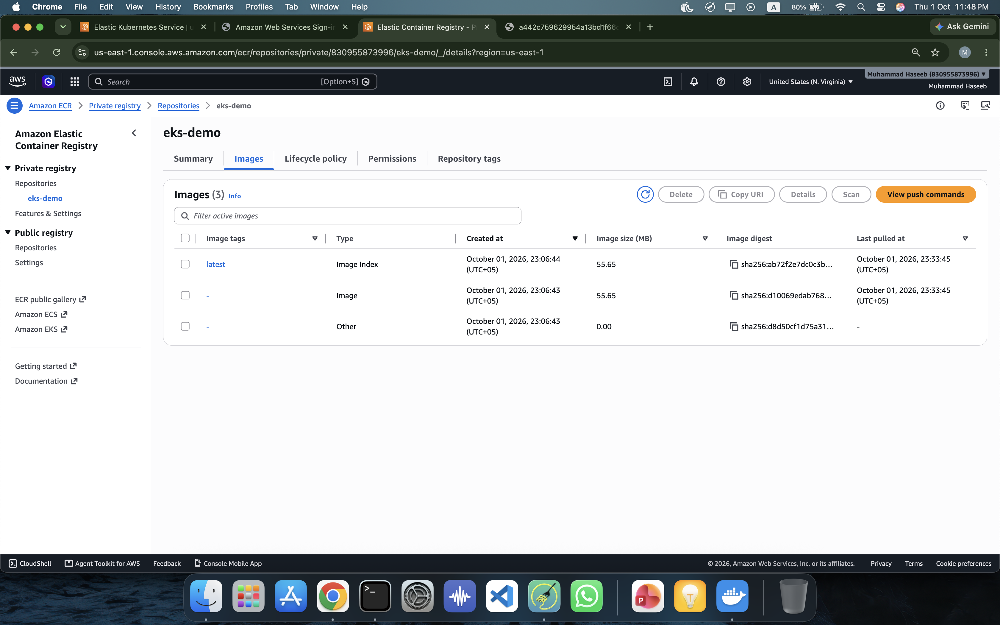

# Helm: an EKS Control Room

## Overview

**Helm: an EKS Control Room** is a FastAPI-based Kubernetes dashboard deployed on Amazon EKS.

The project is designed to show what is actually happening inside the Kubernetes cluster where the application is running. Instead of displaying only static demo information, the application reads live Kubernetes data when it is running inside the cluster.

The dashboard provides information about pods, nodes, deployments, events, the current serving pod, and container resource usage.

## Project Objectives

This project demonstrates a complete container-to-cloud deployment workflow:

```text
FastAPI Application
        ↓
Docker Image
        ↓
Amazon ECR
        ↓
Amazon EKS
        ↓
Kubernetes Deployment
        ↓
Multiple Pods
        ↓
Kubernetes Service
        ↓
AWS Network Load Balancer
        ↓
Browser
```

It combines application development with practical Cloud and DevOps concepts such as Docker, Amazon ECR, Amazon EKS, Kubernetes, RBAC, health probes, resource management, and load balancing.

## Key Features

- FastAPI backend
- Web-based EKS control-room dashboard
- Live Kubernetes cluster information
- Pod status and restart information
- Pod-to-node mapping
- Pod IP information
- Deployment information
- Recent Kubernetes events
- Current serving pod information
- Container CPU and memory information
- Kubernetes API integration
- Read-only RBAC permissions
- Kubernetes readiness and liveness probes
- Three application replicas
- Pod distribution using topology spread constraints
- Non-root container
- Read-only container filesystem
- Resource requests and limits
- Amazon ECR image storage
- Amazon EKS deployment
- AWS Network Load Balancer

## Architecture

```text
                         Internet
                            │
                            ▼
                 AWS Network Load Balancer
                            │
                            ▼
                    Kubernetes Service
                            │
              ┌─────────────┼─────────────┐
              ▼             ▼             ▼
           Pod 1          Pod 2          Pod 3
              │             │             │
              └─────────────┼─────────────┘
                            │
                    Kubernetes API
                            │
              ┌─────────────┼─────────────┐
              ▼             ▼             ▼
            Pods           Nodes         Events
                            │
                            ▼
                    Read-only RBAC
```

### Application data flow

The application obtains its own pod information through the Kubernetes Downward API. It uses the Kubernetes API to read cluster resources such as pods, nodes, deployments, and events.

The application's ServiceAccount is intentionally restricted to read-only operations.

## Technology Stack

| Technology | Purpose |
|---|---|
| Python | Application language |
| FastAPI | Backend/API framework |
| Uvicorn | ASGI server |
| Docker | Containerization |
| Amazon ECR | Container image registry |
| Amazon EKS | Managed Kubernetes |
| Kubernetes | Container orchestration |
| kubectl | Kubernetes management |
| eksctl | EKS cluster management |
| AWS Network Load Balancer | External application access |
| Kubernetes RBAC | Authorization |
| Kubernetes Downward API | Pod metadata |

## Project Structure

```text
day-14-aws-eks/
│
├── README.md
├── EKS-Guide.md
│
├── project/
│   ├── Dockerfile
│   │
│   ├── app/
│   │   ├── __init__.py
│   │   ├── main.py
│   │   ├── demo.py
│   │   ├── metrics.py
│   │   ├── k8s.py
│   │   └── requirements.txt
│   │
│   └── k8s/
│       ├── deployment.yaml
│       ├── namespace.yaml
│       ├── rbac.yaml
│       └── service.yaml
│
└── screenshots/
    ├── 01-eks-cluster-active.png
    ├── 02-eks-nodes-ready.png
    ├── 03-eks-pods-running.png
    ├── 04-eks-loadbalancer-service.png
    ├── 05-eks-service-endpoints.png
    ├── 06-eks-external-health-check.png
    ├── 07-eks-control-room-dashboard.png
    ├── 08-eks-dashboard-pods.png
    ├── 09-eks-dashboard-events.png
    └── 10-ecr-eks-demo-image.png
```

## Application Components

### `main.py`

The main FastAPI application and HTTP endpoints.

Important endpoints include:

- `/healthz`
- `/api/whoami`
- `/api/dashboard`

### `k8s.py`

Handles communication with the Kubernetes API and retrieves cluster information.

### `metrics.py`

Collects container-level CPU and memory information used by the dashboard.

### `demo.py`

Provides sample information when the application is running outside Kubernetes, such as during local Docker testing.

### `static/`

Contains the dashboard's frontend assets.

## Dockerization

The application is packaged as a Docker image.

The container:

- Uses Python 3.12 slim
- Installs application dependencies
- Runs Uvicorn
- Exposes port `8000`
- Runs as a non-root user
- Uses UID `10001`

The container image is built for `linux/amd64` for compatibility with the x86_64 EKS worker nodes used in the project.

## Local Testing

Build the image:

```bash
docker build -t eks-demo .
```

Run the application:

```bash
docker run --rm -p 8000:8000 eks-demo
```

Open:

```text
http://localhost:8000
```

When running outside Kubernetes, the application displays clearly labelled sample data where live Kubernetes information is unavailable.

## Amazon ECR

The Docker image was stored in Amazon Elastic Container Registry before being deployed to EKS.

Example workflow:

```bash
aws ecr create-repository   --repository-name eks-demo   --region us-east-1
```

Authenticate Docker with ECR:

```bash
aws ecr get-login-password --region us-east-1 | docker login --username AWS --password-stdin 830955873996.dkr.ecr.us-east-1.amazonaws.com
```

Build an EKS-compatible image:

```bash
docker build --platform linux/amd64 -t eks-demo:latest .
```

Tag the image:

```bash
docker tag eks-demo:latest 830955873996.dkr.ecr.us-east-1.amazonaws.com/eks-demo:latest
```

Push the image:

```bash
docker push 830955873996.dkr.ecr.us-east-1.amazonaws.com/eks-demo:latest
```

Verify the image:

```bash
aws ecr describe-images   --repository-name eks-demo   --region us-east-1
```

## Amazon EKS Deployment

The project was deployed to an EKS cluster named:

```text
eks-demo
```

The project used:

```text
Region: us-east-1
Worker nodes: 2
Node type: t3.small
```

The cluster was created with:

```bash
eksctl create cluster   --name eks-demo   --region us-east-1   --nodes 2   --node-type t3.small
```

## Kubernetes Resources

### Namespace

The project uses a dedicated namespace:

```yaml
name: eks-demo
```

This keeps the project's Kubernetes resources logically separated from other workloads.

### Deployment

The Deployment:

- Runs 3 replicas
- Uses the ECR image
- Exposes container port `8000`
- Provides pod metadata through the Downward API
- Defines readiness and liveness probes
- Defines CPU and memory requests/limits
- Runs the container as a non-root user
- Drops Linux capabilities
- Disables privilege escalation
- Uses a read-only root filesystem
- Uses topology spread constraints

### Service

The Service exposes the application internally and provisions an AWS Load Balancer:

```yaml
type: LoadBalancer
```

The project uses an AWS Network Load Balancer annotation.

### RBAC

The application uses a dedicated ServiceAccount with read-only permissions.

The namespace-scoped Role allows:

```text
get
list
```

for selected resources such as:

- pods
- services
- events
- deployments

A separate ClusterRole provides read-only access to nodes because nodes are cluster-scoped resources.

The dashboard cannot create, modify, or delete Kubernetes resources.

## Health Checks

The application exposes:

```text
/healthz
```

Kubernetes uses this endpoint for both:

### Readiness Probe

Determines whether the pod is ready to receive traffic.

### Liveness Probe

Determines whether the application is still alive.

These probes allow Kubernetes to make better decisions about routing traffic and restarting unhealthy containers.

## Resource Management

The Deployment defines:

```yaml
requests:
  cpu: 50m
  memory: 64Mi

limits:
  cpu: 250m
  memory: 256Mi
```

Requests provide Kubernetes with the baseline resources needed by the container, while limits restrict how much CPU and memory the container can consume.

## Security

Several container and Kubernetes security practices were included:

- Dedicated ServiceAccount
- Read-only RBAC
- Non-root container
- Fixed non-root UID
- No privilege escalation
- All Linux capabilities dropped
- Read-only root filesystem
- Namespace isolation
- Limited Kubernetes API permissions

The dashboard is intended as a learning/demo project. Because it displays cluster information, production deployments should carefully consider access restrictions and authentication.

## Verification

Useful commands used during deployment include:

Check nodes:

```bash
kubectl get nodes
```

Check pods:

```bash
kubectl get pods -n eks-demo
```

Check services:

```bash
kubectl get svc -n eks-demo
```

Describe a pod:

```bash
kubectl describe pod <pod-name> -n eks-demo
```

View logs:

```bash
kubectl logs <pod-name> -n eks-demo
```

Check deployments:

```bash
kubectl get deployments -n eks-demo
```

## Load Balancing Test

Because the application runs multiple replicas, requests can be distributed between pods.

Example:

```bash
for i in $(seq 1 12); do
  curl -s http://<load-balancer-address>/api/whoami |   grep -o '"pod":"[^"]*"'
done
```

This can show different pod names serving requests.

## Screenshots

### 1. EKS Cluster

The EKS cluster was successfully created.



### 2. Worker Nodes

The EKS worker nodes were registered and ready.



### 3. Running Pods

The application Deployment is running three replicas.



### 4. Load Balancer Service

The Kubernetes LoadBalancer Service was provisioned for external access.



### 5. Service Endpoints

The application's Kubernetes service endpoints were verified.



### 6. External Health Check

The deployed application was successfully reached externally.



### 7. EKS Control Room

The deployed application dashboard displays live cluster information.



### 8. Dashboard Pods

The dashboard displays pod-level information.



### 9. Dashboard Events

The dashboard displays recent Kubernetes events.



### 10. ECR Image

The container image is stored in Amazon ECR.



## Cleanup

The Kubernetes resources can be removed with:

```bash
kubectl delete -f project/k8s/
```

The EKS cluster can then be deleted:

```bash
eksctl delete cluster   --name eks-demo   --region us-east-1
```

Deleting the cluster after completing the lab avoids leaving AWS resources running unnecessarily.

## What I Learned

Through this project, I worked with:

- Docker image architecture
- Amazon ECR
- Amazon EKS
- Kubernetes Deployments
- Pods and replicas
- Kubernetes Services
- AWS Load Balancing
- Kubernetes namespaces
- ServiceAccounts
- RBAC
- Kubernetes API access
- Downward API
- Readiness and liveness probes
- Resource requests and limits
- Container security
- Pod distribution
- `kubectl`
- `eksctl`
- End-to-end cloud deployment

## Related Guide

For the complete conceptual and hands-on EKS guide:

**[Read EKS-Guide.md](EKS-Guide.md)**
