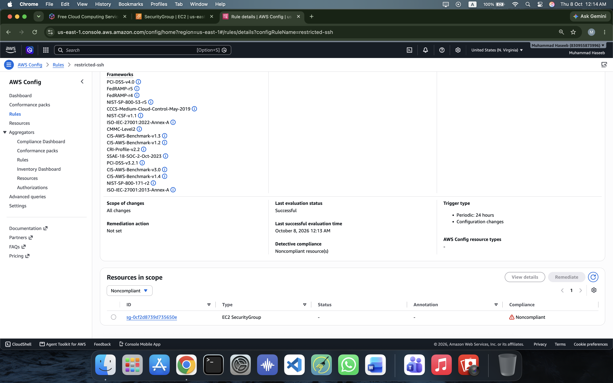
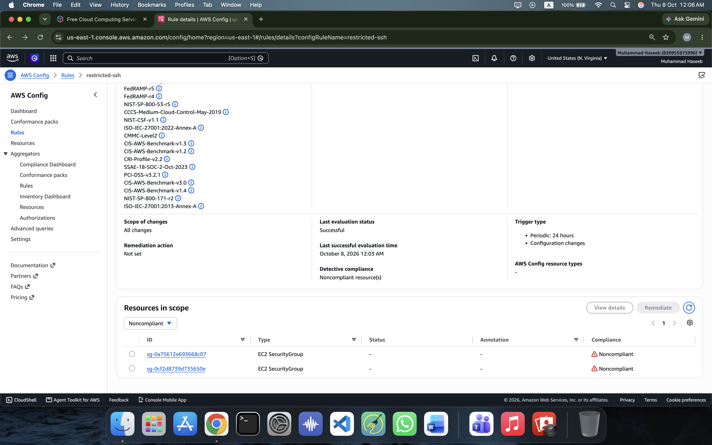
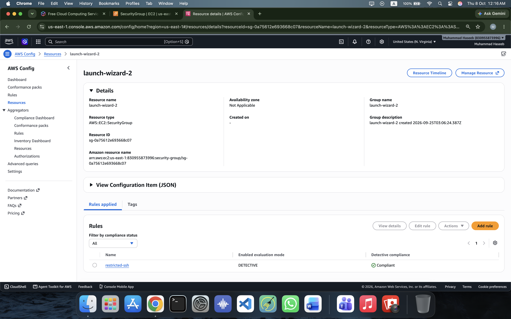

# Day 17 — AWS Config

## Identify Compliant and Non-Compliant AWS Resources

### What is AWS Config?

AWS Config is a service that continuously records the configuration of AWS resources and evaluates them against rules.

It helps answer questions such as:

* What AWS resources do I have?
* How are my resources configured?
* What changed in a resource?
* When did the configuration change?
* Does a resource follow my organization's security policies?

### Real-World Scenario

Imagine a company has hundreds of EC2 security groups.

The company's security policy says:

> SSH (port 22) must not be accessible from the entire internet.

An engineer accidentally creates a security group with:

```text
SSH
Port: 22
Source: 0.0.0.0/0
```

This means anyone on the internet can attempt to connect through SSH.

AWS Config can automatically detect this configuration and mark the security group as:

```text
NON_COMPLIANT
```

After the engineer restricts SSH access to a trusted IP address, AWS Config evaluates the resource again and can mark it:

```text
COMPLIANT
```

---

# AWS Config Workflow

The basic workflow is:

```text
AWS Resource
     ↓
AWS Config records configuration
     ↓
Config Rule evaluates resource
     ↓
COMPLIANT / NON_COMPLIANT
     ↓
Engineer fixes NON_COMPLIANT resource
     ↓
AWS Config evaluates again
```

AWS Config detects and evaluates the configuration. The engineer or another remediation mechanism is responsible for fixing the resource.

---

# Important AWS Config Concepts

## 1. Configuration Recorder

The configuration recorder records configuration information about supported AWS resources.

For example:

```text
Security Group
     ↓
Configuration Recorder
     ↓
AWS Config stores configuration information
```

---

## 2. Configuration Item

A Configuration Item represents the configuration of an AWS resource at a particular point in time.

For example, a security group may have:

### Before

```text
SSH :22
Source: 0.0.0.0/0
```

### After

```text
SSH :22
Source: Trusted-IP/32
```

AWS Config can record these configuration changes.

---

## 3. Configuration Timeline

The Resource Timeline allows us to see configuration information captured over time for a resource.

It helps answer:

> "What changed in this resource?"

For our security group, the timeline helps demonstrate that the SSH configuration changed from unrestricted internet access to restricted access.

---

## 4. Config Rule

A Config Rule defines the policy that AWS Config uses to evaluate resources.

In this lab we used the AWS managed rule:

```text
restricted-ssh
```

The rule evaluates:

```text
AWS::EC2::SecurityGroup
```

Its purpose is to identify security groups that allow unrestricted SSH access.

---

## 5. Compliance Status

AWS Config can classify a resource as:

### COMPLIANT

The resource follows the rule.

Example:

```text
SSH :22
Source: Trusted-IP/32
```

### NON_COMPLIANT

The resource violates the rule.

Example:

```text
SSH :22
Source: 0.0.0.0/0
```

---

# Hands-On Lab

## Objective

Create an AWS Config rule that identifies security groups with unrestricted SSH access and then fix a non-compliant security group.

---

## Step 1 — Open AWS Config

Open the AWS Console and search for:

```text
AWS Config
```

Make sure you are working in:

```text
us-east-1
N. Virginia
```

---

## Step 2 — Configure AWS Config

Open:

```text
AWS Config → Settings
```

Configure AWS Config to record the required resources.

For this lab, the important resource type is:

```text
AWS::EC2::SecurityGroup
```

Enable continuous recording and configure the required AWS Config service-linked role and S3 delivery location.

---

# Step 3 — Create the Config Rule

Go to:

```text
AWS Config → Rules
```

Choose:

```text
Add rule
```

Search for:

```text
restricted-ssh
```

Select the AWS managed rule.

The rule evaluates:

```text
AWS::EC2::SecurityGroup
```

Create the rule with the name:

```text
restricted-ssh
```

---

# Step 4 — Evaluate the Rule

After creating the rule, AWS Config evaluates the security groups.

The initial evaluation found two non-compliant security groups.

Example:

```text
launch-wizard-2
sg-0a75612e693668c07

NON_COMPLIANT
```

and another security group:

```text
sg-0cf2d8739d735650e

NON_COMPLIANT
```

### Screenshot



This screenshot demonstrates that AWS Config detected security groups violating the SSH security policy.

---

# Step 5 — Investigate the Security Group

Open the non-compliant security group:

```text
launch-wizard-2
```

Security Group ID:

```text
sg-0a75612e693668c07
```

Check the inbound rules.

The problematic configuration was:

```text
Type: SSH
Protocol: TCP
Port: 22
Source: 0.0.0.0/0
```

### Why is this a problem?

`0.0.0.0/0` means the SSH port is accessible from any IPv4 address on the internet.

This violates the `restricted-ssh` rule.

---

# Step 6 — Fix the Security Group

Edit the inbound rule.

Change:

```text
0.0.0.0/0
```

to a trusted IP address using `/32`.

Example:

```text
SSH
TCP
22
Trusted-IP/32
```

In this lab, the SSH source was restricted to the user's current public IP using `/32`.

Save the security group rule.

---

# Step 7 — Re-Evaluate the Config Rule

Return to:

```text
AWS Config → Rules → restricted-ssh
```

Choose the option to manually re-evaluate the rule.

Wait for the evaluation to complete.

After re-evaluation, the previously fixed security group should no longer appear as non-compliant.

The remaining security group was still:

```text
NON_COMPLIANT
```

because it had not been fixed.

### Screenshot



This demonstrates that AWS Config detected the change after the security group was fixed.

---

# Step 8 — Verify the Resource Compliance

Go to:

```text
AWS Config → Resources
```

Filter the resource type to:

```text
AWS::EC2::SecurityGroup
```

Open:

```text
launch-wizard-2
```

Resource ID:

```text
sg-0a75612e693668c07
```

Under the applied rules, verify:

```text
restricted-ssh
Detective compliance: Compliant
```

### Screenshot



This confirms that the security group now satisfies the AWS Config rule.

---

# Step 9 — Understand the Final Result

The complete scenario was:

### Initial state

```text
SSH → 0.0.0.0/0
        ↓
AWS Config
        ↓
NON_COMPLIANT
```

### Engineer fixes the resource

```text
SSH → Trusted-IP/32
```

### AWS Config evaluates again

```text
Trusted-IP/32
        ↓
AWS Config
        ↓
COMPLIANT
```

This is the main purpose of AWS Config compliance checking.

---

# What I Learned

From this lab, I learned:

* AWS Config records AWS resource configurations.
* Config Rules evaluate resources against policies.
* Resources can be classified as COMPLIANT or NON_COMPLIANT.
* The `restricted-ssh` rule can detect unrestricted SSH access.
* `0.0.0.0/0` allows access from the entire IPv4 internet.
* Restricting SSH to a trusted IP using `/32` improves security.
* AWS Config can detect configuration changes after a resource is modified.
* Configuration timelines help investigate changes over time.
* AWS Config is primarily for recording, monitoring, and compliance evaluation; remediation can be performed separately.

---

# Real-World DevOps Use Case

In a production environment, a company could create policies such as:

```text
SSH must not be open to the internet
S3 buckets must not be public
Encryption must be enabled
Required tags must exist
Root account access should be restricted
CloudTrail must be enabled
```

AWS Config can continuously evaluate resources against these policies.

A DevOps engineer can then investigate and remediate resources that become non-compliant.

---

# Final Result

```text
AWS Security Group
        ↓
restricted-ssh Rule
        ↓
Configuration Evaluation
        ↓
NON_COMPLIANT
        ↓
Security Group Fixed
        ↓
Re-Evaluation
        ↓
COMPLIANT
```

**Day 17 completed — AWS Config: Identify Compliant and Non-Compliant AWS Resources.**
