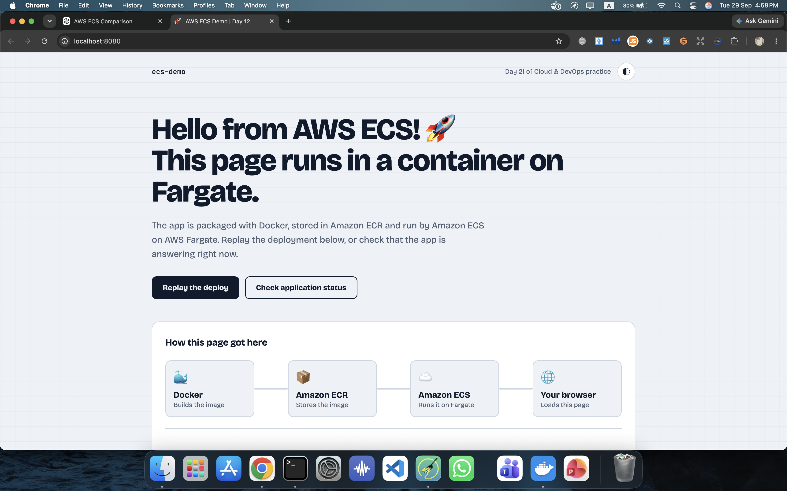
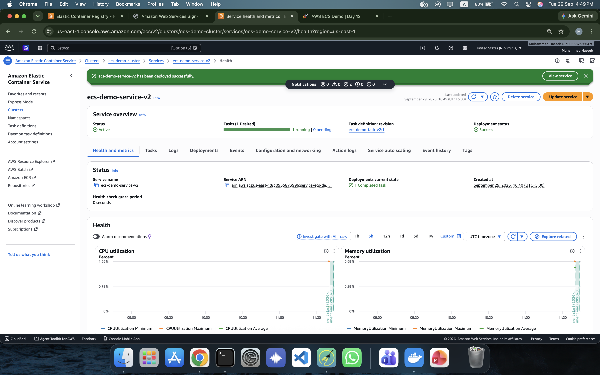
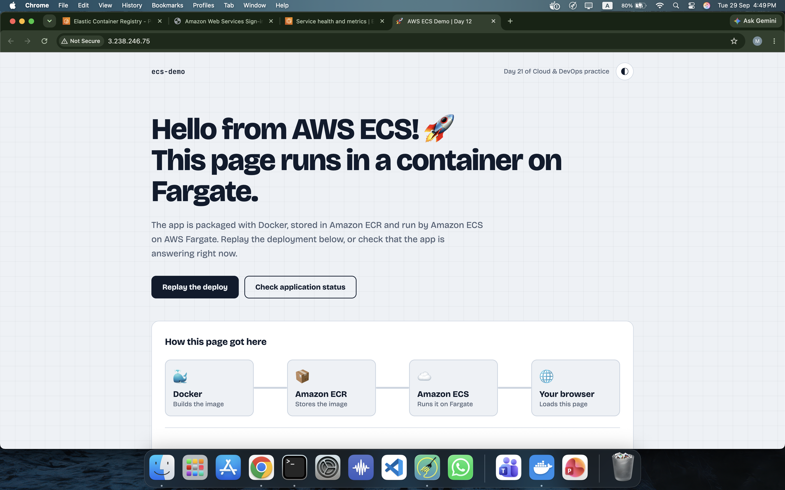

# Day 21 — Amazon ECS with AWS Fargate 🚀

## 📌 Overview

Amazon Elastic Container Service (Amazon ECS) is a fully managed AWS service for running and managing Docker containers.

In this project, I deployed a Dockerized static web application to **Amazon ECS using AWS Fargate**.

The complete workflow was:

```text
HTML / CSS / JavaScript
          ↓
       Docker
          ↓
    Docker Image
          ↓
     Amazon ECR
          ↓
     Amazon ECS
          ↓
     AWS Fargate
          ↓
   Running Container
          ↓
      Public IP
          ↓
      Web Browser
```

---

# ☁️ What is Amazon ECS?

**Amazon ECS (Elastic Container Service)** is an AWS container orchestration service.

It allows us to:

* Run Docker containers
* Manage containers
* Define how containers should run
* Create multiple running instances of an application
* Restart failed containers
* Scale applications
* Integrate containers with other AWS services

Instead of manually running Docker containers on a server, ECS manages the container workload for us.

---

# 🐳 Docker vs Amazon ECS

Docker and ECS are not the same thing.

### Docker

Docker is used to:

* Build container images
* Create containers
* Run containers
* Package applications with their dependencies

### Amazon ECS

ECS is used to:

* Manage containers
* Schedule containers
* Maintain desired task counts
* Deploy applications
* Scale container workloads
* Integrate containers with AWS infrastructure

A simple way to remember:

```text
Docker = Build and run containers

ECS = Manage containers at scale
```

---

# 🧩 Important ECS Components

## 1. ECS Cluster

A cluster is a logical grouping of ECS resources.

Our cluster:

```text
ecs-demo-cluster
```

---

## 2. Task Definition

A Task Definition is the configuration or **recipe** that tells ECS how to run a container.

Our task definition:

```text
ecs-demo-task-v2:1
```

It defined:

```text
CPU:              0.25 vCPU
Memory:           0.5 GiB
Operating System: Linux
Architecture:     X86_64
Network Mode:     awsvpc
Container Port:   80
Launch Type:      Fargate
```

---

## 3. Task

A Task is the actual running instance created from a Task Definition.

For this project, ECS launched one Fargate task.

```text
Task Status: Running
Launch Type: Fargate
```

---

## 4. Service

An ECS Service keeps the required number of tasks running.

Our service:

```text
ecs-demo-service-v2
```

Desired count:

```text
1
```

This means ECS should maintain one running task for the service.

---

## 5. Fargate

AWS Fargate is a serverless compute engine for containers.

With Fargate, we don't need to manage the underlying EC2 servers.

```text
Traditional ECS:

ECS → EC2 → Docker Container


Fargate:

ECS → Fargate → Container
```

---

# 📦 Project Application

For this project, I created a simple static web application using:

```text
HTML
CSS
JavaScript
```

The application contains:

* ECS demonstration page
* Architecture cards
* Docker information
* ECR information
* ECS information
* Application status button

---

# 📁 Project Structure

```text
ecs-demo-app/
│
├── index.html
├── style.css
├── script.js
└── Dockerfile
```

---

# 🐳 Dockerfile

The application uses Nginx as the web server.

```dockerfile
FROM nginx:alpine

COPY index.html /usr/share/nginx/html/index.html
COPY style.css /usr/share/nginx/html/style.css
COPY script.js /usr/share/nginx/html/script.js

EXPOSE 80
```

### Explanation

`FROM nginx:alpine`

Uses the lightweight Nginx Alpine image.

`COPY`

Copies the application files into Nginx's web directory.

`EXPOSE 80`

Documents that the application listens on port 80 inside the container.

---

# 🧪 Step 1 — Run the Application Locally

First, I built the Docker image:

```bash
docker build -t ecs-demo-app:v1 .
```

Then I ran the container:

```bash
docker run -d --name ecs-demo-container -p 8080:80 ecs-demo-app:v1
```

The mapping:

```text
Mac Port 8080
      ↓
Container Port 80
      ↓
Nginx
```

The application was available at:

```text
http://localhost:8080
```

### Screenshot



---

# 🏗️ Step 2 — Build the ECS-Compatible Docker Image

Because the application was being developed on an Apple Silicon Mac, the initial Docker image was built for ARM64.

AWS Fargate was configured for:

```text
X86_64 / amd64
```

The initial deployment failed because the image did not contain an `linux/amd64` image manifest.

I rebuilt the image specifically for AMD64:

```bash
docker build --platform linux/amd64 -t ecs-demo-app:v2 .
```

This created an image compatible with the Fargate task architecture.

### Screenshot


---

# 📦 Step 3 — Create Amazon ECR Repository

Amazon ECR (Elastic Container Registry) is a managed container image registry.

I created the repository:

```text
ecs-demo-app
```

Repository URI:

```text
830955873996.dkr.ecr.us-east-1.amazonaws.com/ecs-demo-app
```

---

# 🔐 Step 4 — Authenticate Docker with ECR

I authenticated Docker with Amazon ECR using:

```bash
aws ecr get-login-password --region us-east-1 | docker login --username AWS --password-stdin 830955873996.dkr.ecr.us-east-1.amazonaws.com
```

Expected output:

```text
Login Succeeded
```

---

# 🏷️ Step 5 — Tag the Docker Image

```bash
docker tag ecs-demo-app:v2 \
830955873996.dkr.ecr.us-east-1.amazonaws.com/ecs-demo-app:v2
```

This gives the local image the ECR repository name.

---

# 🚀 Step 6 — Push Image to ECR

```bash
docker push \
830955873996.dkr.ecr.us-east-1.amazonaws.com/ecs-demo-app:v2
```

The image was successfully uploaded to ECR.

### Screenshot


---

# ☁️ Step 7 — Create ECS Cluster

I created the ECS cluster:

```text
ecs-demo-cluster
```

The cluster provides the logical environment where the ECS service and tasks run.

---

# 📋 Step 8 — Create Fargate Task Definition

I created:

```text
ecs-demo-task-v2:1
```

Configuration:

```text
Launch Type:       Fargate
Operating System:  Linux
Architecture:      X86_64
CPU:               0.25 vCPU
Memory:            0.5 GiB
Network Mode:      awsvpc
Container Port:    80
Protocol:          TCP
```

The container image was:

```text
830955873996.dkr.ecr.us-east-1.amazonaws.com/ecs-demo-app:v2
```

### Screenshot


---

# ⚙️ Step 9 — Create ECS Service

I created the ECS service:

```text
ecs-demo-service-v2
```

Configuration:

```text
Scheduling Strategy: Replica
Desired Tasks:       1
Capacity Provider:   Fargate
```

The service successfully reached:

```text
1 Desired
1 Running
0 Pending
```

### Screenshot



---

# 🌐 Step 10 — Configure Networking

The task used:

```text
Network Mode: awsvpc
```

Each Fargate task receives its own network interface.

The running task received:

```text
Private IP: 172.31.66.206
Public IP: 3.238.246.75
```

The service had:

```text
Auto-assign Public IP: ON
```

The container was listening on:

```text
Port 80
```

### Screenshot


---

# 🌍 Step 11 — Access the Application

After the Fargate task entered the `Running` state, I accessed the application using its public IP.

```text
http://<PUBLIC-IP>
```

The application successfully loaded in the browser.

### Screenshot



---

# 🏗️ Final Architecture

```text
                    Developer
                        │
                        ▼
                 HTML/CSS/JS App
                        │
                        ▼
                     Docker
                        │
                        ▼
                  Docker Image
                        │
                        ▼
                Amazon ECR
                        │
                        │ Pull Image
                        ▼
                Amazon ECS
                        │
                        ▼
                   AWS Fargate
                        │
                        ▼
                 Running Task
                        │
                 ┌──────┴──────┐
                 │             │
             Private IP     Public IP
                 │             │
                 └──────┬──────┘
                        ▼
                   Web Browser
```

---

# 🧠 Important Concepts Learned

### ECS Cluster

Logical grouping of ECS resources.

### Task Definition

Defines how a container should run.

### Task

The actual running container workload.

### Service

Maintains the desired number of running tasks.

### Fargate

Runs containers without requiring us to manage EC2 servers.

### ECR

Stores Docker container images.

### awsvpc

Provides networking for ECS tasks using VPC networking.

---

# ⚠️ Important Issue I Encountered

During the first deployment, the Fargate task failed with:

```text
CannotPullContainerError

image Manifest does not contain descriptor
matching platform 'linux/amd64'
```

### Why?

My MacBook uses Apple Silicon, so the original Docker image was built for:

```text
linux/arm64
```

The ECS task was configured for:

```text
linux/amd64
```

### Solution

I rebuilt the image using:

```bash
docker build --platform linux/amd64 -t ecs-demo-app:v2 .
```

Then pushed the new image to ECR.

The new Fargate task started successfully.

### Key Lesson

Always make sure the Docker image architecture matches the architecture configured for the target environment.

---

# 🧹 Cleanup

After completing the hands-on lab, I stopped and deleted the ECS resources to avoid unnecessary AWS charges.

Resources used included:

```text
ECS Cluster
ECS Service
Fargate Task
Task Definition
ECR Repository/Image
Security Group
```

---

# 🎯 Key Takeaways

Through this project, I learned the complete container deployment workflow on AWS:

```text
Build
  ↓
Containerize
  ↓
Push to ECR
  ↓
Create Task Definition
  ↓
Create ECS Service
  ↓
Run on Fargate
  ↓
Configure Networking
  ↓
Access Application
```

This project gave me practical experience with **Docker, Amazon ECR, Amazon ECS, AWS Fargate, VPC networking, task definitions, services, and container deployment**.

---

## 🚀 Next Learning

Next, I will continue deeper into container orchestration and AWS infrastructure, including:

* ECS service scaling
* Load balancing with ALB
* ECS service discovery
* CloudWatch monitoring
* CI/CD deployment
* ECS task health checks
* Infrastructure as Code
* Production-style ECS architecture
