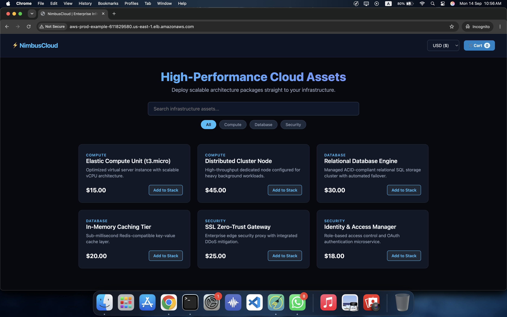
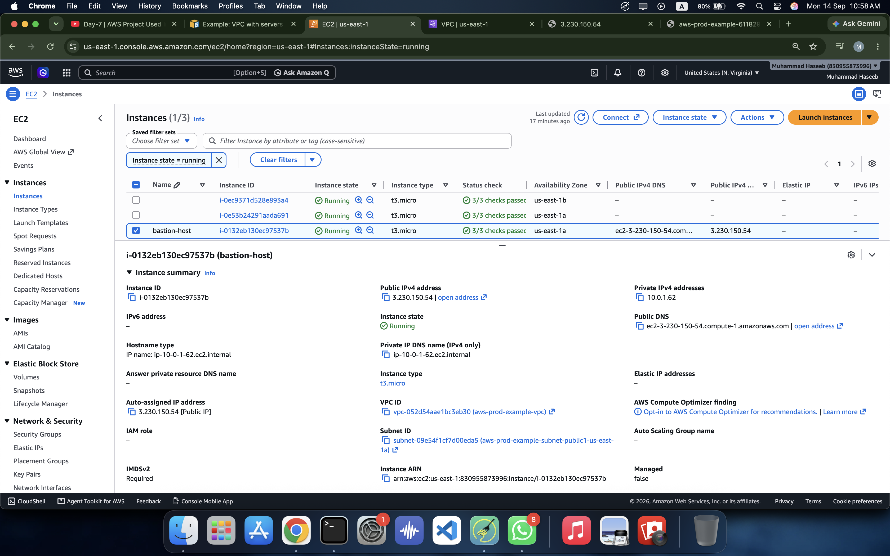
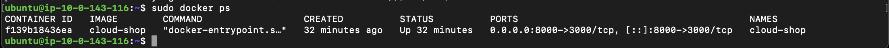
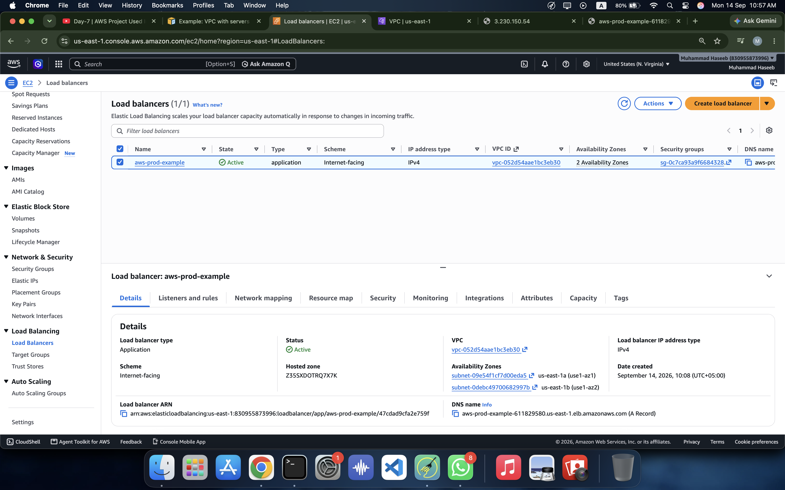
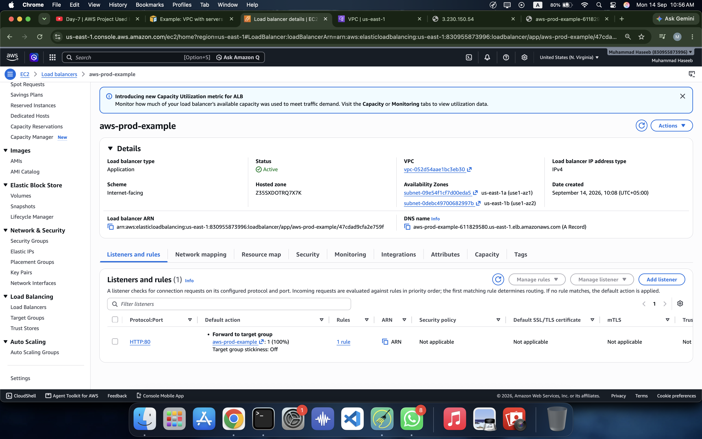
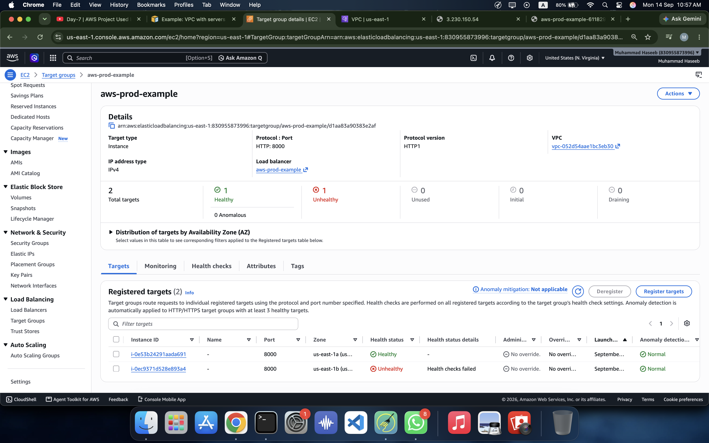

# Cloud Shop — AWS Deployment

A hands-on AWS deployment project where I containerized a Node.js web application with Docker and deployed it on an AWS VPC using EC2, private subnets, a Bastion Host, NAT Gateway, Application Load Balancer, Target Group, and Security Groups.

This project was built as part of my AWS and Cloud/DevOps learning journey.

> **Status:** Deployment completed and tested. AWS resources were deleted after testing to avoid unnecessary costs.

---

## Project Overview

**Cloud Shop** is a simple web application served by a Node.js server.

The application was first containerized using Docker and then deployed to an AWS EC2 instance inside a private subnet.

Instead of exposing the application EC2 instance directly to the internet, an **Application Load Balancer (ALB)** was used as the public entry point.

A **Bastion Host** was used for administrative SSH access to the private EC2 instance.

### Main Technologies

* AWS
* Amazon VPC
* Amazon EC2
* Application Load Balancer
* Target Groups
* Security Groups
* Internet Gateway
* NAT Gateway
* Docker
* Node.js
* Git & GitHub

---

# Architecture

The deployment followed this general architecture:

```text
                         Internet
                            |
                            |
                       Route / HTTP
                            |
                            v
                Application Load Balancer
                       Public Subnets
                      /              \
                     /                \
                    v                  v
              Availability Zone A   Availability Zone B
                    |                  |
                    |                  |
              Private Subnet      Private Subnet
                    |                  |
                    v                  v
               EC2 Instance       EC2 Instance
                    |                  |
                    +--------+---------+
                             |
                           Docker
                             |
                       Cloud Shop App
```

For administrative access:

```text
                         My Mac
                           |
                           | SSH
                           v
                     Bastion Host
                     Public Subnet
                           |
                           | SSH
                           v
                    Private EC2
                    Private Subnet
                           |
                         Docker
                           |
                      Cloud Shop
```

The Bastion Host was used only for administration. Application traffic was handled by the Application Load Balancer.

---

# AWS Architecture Components

## 1. VPC

A dedicated VPC was created for the project.

The VPC provided the isolated network environment for the AWS resources.

The network was divided into:

* Public subnets
* Private subnets
* Availability Zones

The public subnets were used for internet-facing components such as the Application Load Balancer and Bastion Host.

The application EC2 instance was placed inside a private subnet.

---

## 2. Public Subnet

The public subnet had a route to the Internet Gateway.

```text
Public Subnet
      |
      v
Internet Gateway
      |
      v
Internet
```

Resources that needed direct inbound internet access could be placed in the public subnet.

For this project:

* Application Load Balancer
* Bastion Host

were associated with the public side of the architecture.

---

## 3. Private Subnet

The application EC2 instance was placed inside a private subnet.

The private EC2 instance did not need a public IP address.

```text
Internet
   X
   |
Private EC2
```

The application was instead reached through the Application Load Balancer.

This provides a better security boundary because the application server is not directly exposed to the internet.

---

## 4. Internet Gateway

The Internet Gateway provided internet connectivity for resources in the public subnets.

The public subnet route table contained a default route similar to:

```text
0.0.0.0/0 → Internet Gateway
```

---

## 5. NAT Gateway

The private subnet required outbound internet connectivity.

A NAT Gateway was used so that private resources could initiate outbound connections without accepting unsolicited inbound connections from the internet.

For example, the private EC2 instance needed internet access to:

* Clone the GitHub repository
* Install Docker
* Download packages
* Pull container images

The traffic flow was:

```text
Private EC2
     |
     v
NAT Gateway
     |
     v
Internet Gateway
     |
     v
Internet
```

---

# Bastion Host

Because the application EC2 instance was private, I could not SSH directly into it from my Mac.

A Bastion Host was used as an intermediate SSH server.

The connection flow was:

```text
Mac
 |
 | SSH
 v
Bastion Host
 |
 | SSH
 v
Private EC2
```

The private EC2 Security Group allowed SSH traffic from the Bastion Host Security Group.

This is an important concept when working with private infrastructure.

---

# Docker Deployment

The Cloud Shop application was containerized using Docker.

The application contains:

```text
cloud-shop/
├── public/
│   ├── index.html
│   ├── style.css
│   └── app.js
├── server.js
├── package.json
└── Dockerfile
```

The Docker image was built with:

```bash
docker build -t cloud-shop .
```

The application was then started as a Docker container.

The final port mapping used during the AWS deployment was:

```text
EC2 Port 8000
      |
      v
Docker Container Port 3000
```

The container was started with:

```bash
docker run -d --name cloud-shop -p 8000:3000 cloud-shop
```

This means:

* The Node.js application listens on port `3000` inside the container.
* Docker exposes it through port `8000` on the EC2 instance.
* The Target Group communicates with EC2 on port `8000`.

---

# Application Load Balancer

An internet-facing Application Load Balancer was used as the public entry point for the application.

Instead of users connecting directly to EC2:

```text
User → EC2
```

the architecture uses:

```text
User
 |
 v
Application Load Balancer
 |
 v
Target Group
 |
 v
Private EC2
 |
 v
Docker
 |
 v
Cloud Shop
```

This provides a cleaner separation between the public-facing layer and the application servers.

---

# Target Group

A Target Group was created for the application EC2 instances.

The Target Group used:

```text
Protocol: HTTP
Port: 8000
```

The ALB listener received HTTP traffic on port `80` and forwarded it to the Target Group.

```text
Client
  |
  | HTTP :80
  v
ALB
  |
  | HTTP :8000
  v
Target Group
  |
  v
EC2 :8000
  |
  v
Docker :3000
```

The Target Group also performed health checks to determine whether the registered targets were responding correctly.

---

# Security Groups

Security Groups were used to control traffic between the different components.

## Bastion Host

SSH access was configured for administrative access.

```text
Inbound:
SSH :22
Source: Administrator IP
```

---

## Private EC2

The application EC2 was not intended to be directly accessible from the internet.

The important rules were:

```text
SSH :22
Source: Bastion Host Security Group

Application :8000
Source: ALB Security Group
```

This creates a security relationship between the components instead of opening the application port to everyone.

---

# Deployment Flow

The complete deployment process was:

```text
1. Create VPC
       ↓
2. Create public/private subnets
       ↓
3. Configure route tables
       ↓
4. Configure Internet Gateway
       ↓
5. Configure NAT Gateway
       ↓
6. Launch Bastion Host
       ↓
7. Launch private EC2
       ↓
8. Configure Security Groups
       ↓
9. Connect to private EC2 through Bastion
       ↓
10. Install Docker
       ↓
11. Clone Cloud Shop
       ↓
12. Build Docker image
       ↓
13. Run Docker container
       ↓
14. Create Target Group
       ↓
15. Register EC2 target
       ↓
16. Create Application Load Balancer
       ↓
17. Configure ALB listener
       ↓
18. Configure health checks
       ↓
19. Test Cloud Shop through ALB
```

---

# Verification

Several checks were performed during the deployment.

### Check Docker

```bash
docker ps
```

This confirmed that the Cloud Shop container was running.

### Test the application locally on EC2

```bash
curl http://localhost:8000
```

This verified that the application was responding on the EC2 application port.

### Test private EC2 internet access

```bash
curl -I https://github.com
```

This verified outbound internet connectivity from the private instance.

### Test through the Load Balancer

The application was accessed through the ALB DNS name from a browser.

This verified the complete request path:

```text
Browser
   ↓
ALB
   ↓
Target Group
   ↓
Private EC2
   ↓
Docker
   ↓
Cloud Shop
```

---

# Screenshots

The deployment screenshots are included in this documentation.

## Cloud Shop Application



## EC2 Instances



## Docker Container



## Application Load Balancer



## Load Balancer



## Target Group



> The screenshots document the deployment state during testing. AWS resources were deleted after the project was completed.

---

# What I Learned

This project helped me understand how the different AWS components work together instead of studying them separately.

### Networking

I practiced:

* VPC
* Subnets
* Public vs private subnets
* Route tables
* Internet Gateway
* NAT Gateway
* Availability Zones

### Compute

I practiced:

* EC2
* Private EC2 deployment
* Bastion Host
* SSH access
* Connecting to private infrastructure

### Load Balancing

I practiced:

* Application Load Balancer
* Listeners
* Target Groups
* Target registration
* Health checks
* Application traffic flow

### Security

I practiced:

* Security Groups
* Restricting SSH access
* Allowing application traffic only from the required source
* Keeping application servers private

### Containers

I practiced:

* Docker image creation
* Docker containers
* Port mapping
* Running a Node.js application inside Docker

### DevOps

I practiced the complete flow of:

```text
Code
 ↓
GitHub
 ↓
Docker
 ↓
EC2
 ↓
AWS Networking
 ↓
Load Balancer
 ↓
Application
```

---

# Problems I Encountered

This project was also useful because the deployment did not work perfectly on the first attempt.

One important issue was a port mismatch.

The Docker application was initially running as:

```text
EC2 :3000
    ↓
Docker :3000
```

while the Target Group expected:

```text
EC2 :8000
```

The configuration was corrected to:

```text
EC2 :8000
    ↓
Docker :3000
```

using:

```bash
docker run -d --name cloud-shop -p 8000:3000 cloud-shop
```

This helped me understand that the ALB Target Group port, EC2 listening port, Security Group rules, and Docker port mapping all need to match the intended traffic path.

---

# Project Repository

The complete application source code and deployment screenshots are available here:

**[Cloud Shop — GitHub](https://github.com/SkyInfra/cloud-shop)**

---

# Future Improvements

This project can be extended into a more production-oriented architecture.

Possible improvements include:

* Two application instances across two Availability Zones
* HTTPS using ACM
* Route 53 custom domain
* CloudWatch monitoring
* Centralized logging
* S3 integration
* CI/CD pipeline
* Infrastructure as Code using Terraform
* Docker image publishing to Amazon ECR

---

# Final Architecture

The main concept learned from this project is:

```text
                         USERS
                           |
                           v
                Application Load Balancer
                           |
              +------------+------------+
              |                         |
              v                         v
        Private Subnet             Private Subnet
              |                         |
              v                         v
          EC2 Instance              EC2 Instance
              |                         |
              +------------+------------+
                           |
                         Docker
                           |
                      Cloud Shop
```

Administrative access:

```text
Mac
 |
 v
Bastion Host
 |
 v
Private EC2
 |
 v
Docker
 |
 v
Cloud Shop
```

This project gave me practical experience with AWS networking, EC2, Docker, private infrastructure, load balancing, security groups, and application deployment.
